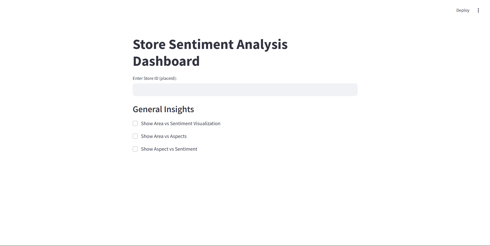

# Aspect Term Extraction and Polarity Classification

## Overview
This project implements **Aspect Term Extraction** and **Polarity Classification** using a sentiment analysis approach. The system analyzes reviews, extracts aspect terms, and classifies their sentiment into Positive, Negative, or Neutral categories.

It also features a **Streamlit GUI Dashboard** to visualize sentiment trends across various aspects and locations.

---

## The Problem: Customer Feedback That’s Hard to Decode

Every day, businesses receive hundreds of customer reviews that contain valuable insights hidden in a sea of text. But understanding these reviews is challenging:

- What aspects of the store or service do customers praise or criticize?  
- Why do customers leave positive, negative, or neutral feedback?  
- Which specific areas or locations require immediate attention?  

Without a structured way to extract aspects from reviews, businesses miss critical opportunities to enhance customer experience and focus on what truly matters.

---

## The Solution: Advanced Review Analysis

Our product revolutionizes how businesses understand and act on customer reviews. Using **natural language processing (NLP)** technology, our tool analyzes reviews to:

1. **Extract Key Aspects**: Identify specific elements like service quality, product availability, pricing, staff behavior, and more.  
2. **Sentiment Analysis**: Determine whether the sentiment associated with each aspect is positive, negative, or neutral.  
3. **Aspects by Location**: Find the exact stores or areas where these sentiments are expressed, helping businesses focus on local challenges or strengths.

---

## The Outcome: Actionable Insights for Success

With our product, businesses can:

- **Improve Customer Experience**: Address the exact reasons for negative feedback and amplify the factors behind positive reviews.  
- **Focus on Severity**: Identify and prioritize the most critical issues affecting stores.  
- **Navigate Localized Strategies**: Develop targeted solutions for specific stores or areas, enhancing performance and customer satisfaction in key regions.

---

## Features
- **Aspect Term Extraction**: Identifies key aspects from customer reviews.
- **Polarity Classification**: Categorizes sentiment into Positive, Negative, or Neutral.
- **Interactive Dashboard**: Visualize insights using **Streamlit**.
- **Data Filtering**: Query results for a specific store/place ID.
- **Heatmaps & Bar Charts**: Explore sentiment trends across locations.
- **General Insights**: Analyze sentiment trends across all stores for broader market insights.

---

## Sample Reviews & Analysis

### Sample Review 1:
“Really great stuff, you can always find something. The employees are always very nice, they also have small talk with the customers. Very helpful, always happy to go.”  
- **Aspect 1 (Stuff)**: Positive with confidence score **99.91%**  
- **Aspect 2 (Employees)**: Positive with confidence score **99.94%**  
**Store Details**: Store ID / Location ID / Address  
**Analysis**: This store excels in providing great products and has a friendly and engaging staff. Customers are highly satisfied with their experience.

### Sample Review 2:
“Great store. The prices have also risen here and the quality has become inferior. I've been buying my boxer shorts at NKD for years; they no longer fit like they did recently. The material has become thinner, and the 3-pack became a 2-pack at the same price.”  
- **Aspect (Prices)**: Negative  
- **Aspect (Quality)**: Negative  
**Store Details**: Store ID / Location ID / Address  
**Analysis**: While the store is appreciated for its offerings, customers are dissatisfied with recent price hikes and perceived quality decline.

### Sample Review 3:
"Friendly employee, invites you to browse. Everyone can find what they are looking for here."
- **Aspect (Employee)**: Positive with confidence score **99.94%**  
**Store Details**: Store ID / Location ID / Address  
**Analysis**: This store is praised for its friendly staff, enhancing the shopping experience for customers.

---

## User-Friendly GUI
- Enter the **placeID** to retrieve Positive, Negative, and Neutral aspects along with visualizations.
### Dashboard Overview

- Click a button to generate all relevant insights instantly.
### Positive aspects based on the given PlaceID

- Choose from multiple visualizations such as bar graphs, heatmaps, and sentiment trends.
- The **General Insights** section shows the overall analysis for all NKD stores in Germany.

---

## Installation
### Prerequisites
Ensure you have **Python 3.7+** installed along with the required libraries.

### Install Dependencies
Run the following command to install necessary packages:
```bash
pip install streamlit pandas matplotlib seaborn
```

---

## Dataset Structure
The application uses CSV files containing:
1. `store_aspect_sentiment_analysis.csv`: Aggregated sentiment counts per store.
2. `reviews_with_aspects_utf8_2024.csv`: Original reviews with extracted aspects and sentiments.

Ensure the CSV files are placed in the working directory.

---

## Usage
### 1. Run the Streamlit GUI
```bash
streamlit run gui.py
```

### 2. Enter Store ID
- Input a **placeId** to retrieve sentiment insights for a specific store.

### 3. Visualize Data
- Toggle various checkboxes to generate charts:
  - **Aspect Sentiment Analysis for Store**
    
  - **Area vs Aspect sentiment**
    
  - **Area vs Aspect Comparisons**
    
    
---

## Contributors
- **[Sayapureddy sai surya teja]** - Developer

---

## License
This project is licensed under the **MIT License**.

---


Turn reviews into your competitive edge. Understand your customers better, improve their experience, and watch your business grow. Contact us to see how our Review Analysis Solution can transform your feedback into actionable strategies! 🚀

